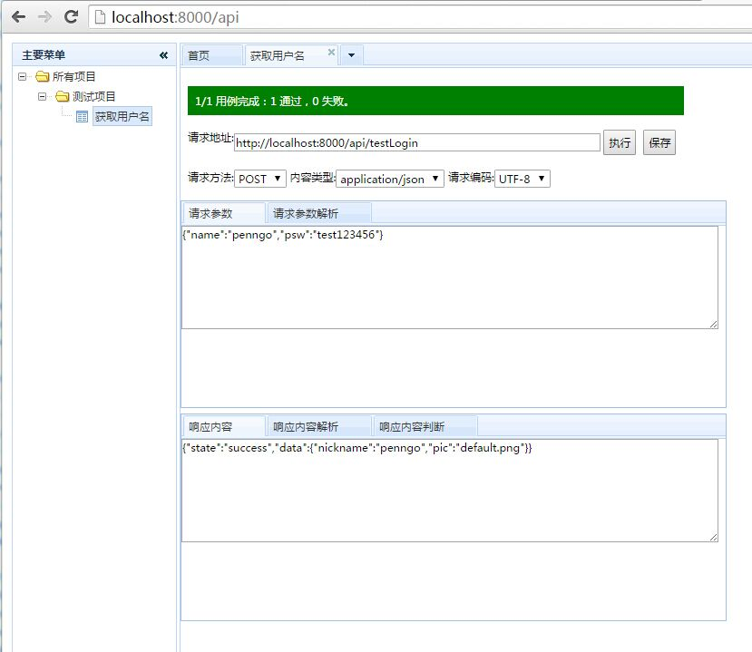
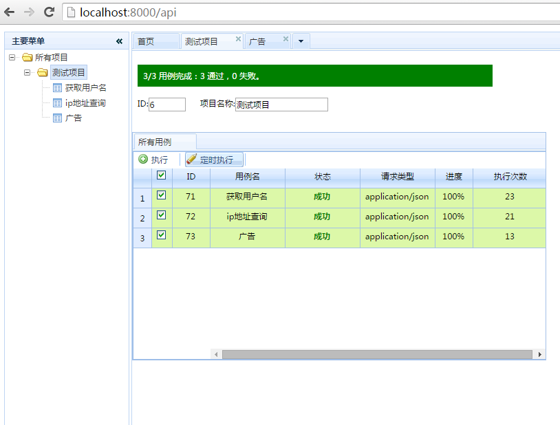

**JApiTest**

http接口测试工具

----------

**下载地址**
[http://git.oschina.net/penngo/JApiTest/attach_files](http://git.oschina.net/penngo/JApiTest/attach_files)

----------

**运行**  
1、请先安装jdk7或jre7以上版本。 
2、解压zip文件 
3、双击运行startup.bat 
4、使用浏览器访问：http://localhost:8000  